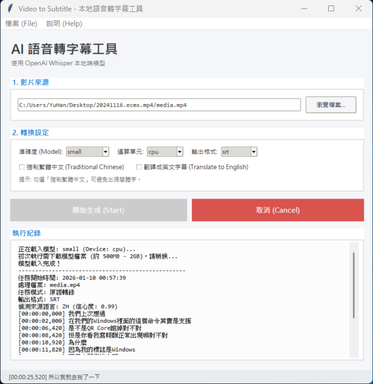

# Video to Subtitle (本地語音轉字幕工具)
本工具是考量了教育部將於 115 學年度起推動之政策要求，針對遠距數位課程須提供完整字幕內容，或建置合理之輔助資源配套措施，以落實保障聽障學生平等受教權而生的解決方案。工具開發初期主要源自個人實際使用需求，考量許多教師在製作數位教材時亦面臨相同挑戰，所以將本工具整理並分享給大家使用。

Video to Subtitle 是一款基於 OpenAI Whisper 模型的本地端桌面應用程式，幫它套上一層圖形介面，簡化 Whisper 的操作流程，使用者僅需進行簡單設定，即可完成影片轉換為字幕檔案（SRT、VTT）的作業。由於程式於本機端執行，無須將影音檔案上傳至雲端，可充分利用使用者電腦算力生成高品質字幕，兼具安全性、免費性與隱私保障，是一套安心可靠的語音轉字幕解決方案。

其實目前網路上已有許多基於 OpenAI Whisper 的字幕產生工具，部分採雲端服務模式，需上傳影片檔案，存在隱私疑慮，或需購買點數並受使用次數限制；另有部分本地端工具，則功能眾多或在操作流程上較為繁瑣，難以一次完成所需作業。本程式係基於實際教學與教材製作情境所開發，使用功能單純，期能以最少步驟完成字幕轉換，提升教師在製作數位教材時的效率與便利性。



## ✨ 主要功能
其實主要功能就是利用 OpenAI Whisper 產生字幕檔案...
* **本地執行**：除下載模型外，完全離線執行，基於 faster-whisper，您的影片與音訊數據永遠不會離 開您的電腦。
* **多模型支援**：整合 tiny 至 large-v3 模型，使用者只要選擇後，程式自動完成下載。
* **簡化操作**：簡化 OpenAI Whisper 的操作過程，使用者只要選擇上轉換的影片，選擇使用模型，即可一鍵完成字幕檔案產出。
* **多格式輸出**：支援輸出 SRT, VTT, TXT, TSV, JSON 等常見格式。
* 支援拖曳檔案 (Drag & Drop) 載入來源檔案

## 使用流程
  1. **選擇要轉換的檔案**：點擊「瀏覽檔案」按鈕或直接將檔案拖曳至程式視窗。
      - **支援格式**：支援 MP4, MP3, MKV, WAV, MOV, AVI, M4A 等常見影音格式。
  2. **設定準確度 (模型)**：依據需求選擇模型大小
      - **Tiny / Base**：速度最快，但準確度較低。
      - **Small / Medium**：速度與準確度的平衡點 (一般用途推薦)。
      - **Large**：準確度最高，但轉換速度慢。
  3. **選擇運算單元與格式**：
      - **運算單元**：Windows (NVIDIA) 可選 cuda 加速；macOS 或無顯卡請選 cpu。
      - **輸出格式**：可選擇 SRT, VTT, TXT, TSV 或 JSON。
      - **進階功能**：可視需求勾選「強制繁體中文」(避免出現簡體中文)或「翻譯成英文」。
  5. **開始生成**：點選「開始生成」按鈕，程式將自動處理。等待進度條跑完後，會顯示總耗時與檔案儲存路徑。
  6. **轉換完畢**：轉換完畢後，可開啟輸出檔案確認，根據模型不同精準度也有不同，所以請務必後續自行確認字幕的正確性，必要時請進行人工修訂。
  7. 後續可根據遠距教學平台之功能掛上字幕檔，或者將字幕檔與影片進行結合。

## 模型下載位置
這個程式使用的是 faster-whisper 函式庫，預設會將模型下載到 Hugging Face 的快取目錄中。
根據作業系統，模型存放的位置如下：
  * Windows
    >通常位於： C:\Users\使用者名稱\.cache\huggingface\hub
    >
    >在此資料夾內，您會看到類似 models--Systran--faster-whisper-small 的資料夾，裡面就是模型檔案
    >
    >AppData 是一個隱藏資料夾，您可能需要在檔案總管中開啟「顯示隱藏的項目」才看得到
    
  * macOS
    >通常位於： /Users/使用者名稱/.cache/huggingface/hub
    >
    >.cache 也是隱藏資料夾。您可以在 Finder 中按下 Cmd + Shift + . (句號) 來顯示隱藏檔案，或者在終端機中使用 open ~/.cache/huggingface/hub 直接開啟

這些模型檔案（尤其是 large 模型）可能會佔用 2GB ~ 3GB 的空間；如果您之後想要釋放空間，可以直接刪除該資料夾內的內容，下次程式執行時會再自動下載


## 📥 下載與啟動 (一般 Windows 使用者)
如果您不需要修改程式碼，請直接下載執行檔。
1. 下載程式：[前往 Releases 頁面](https://github.com/kaoshou/Video-to-Subtitle/releases) 下載最新的 VideoToSubtitle.exe。
2. 執行：雙擊 EXE 檔案即可開始使用。初次開啟需要稍待片刻。

## 🛠️ 開發與建置 (開發者)
若您希望從原始碼執行，請參考以下步驟。
1. 環境需求
    - Python 3.8 - 3.11
    - FFmpeg (需加入系統環境變數 PATH)
      * Windows (PowerShell):
        ```
        winget install Gyan.FFmpeg
        ```
      * macOS:
        ```
        brew install ffmpeg
        ```
2. 安裝相依套件
    ```
    # 建議建立虛擬環境 (Optional)
    python -m venv venv
    # Windows:
    .\venv\Scripts\activate
    # macOS/Linux:
    source venv/bin/activate
    
    # 安裝套件
    pip install faster-whisper tk tkinterdnd2
    ```
3. 硬體加速配置
  * **Windows (NVIDIA GPU)**:若要使用 CUDA 加速，需安裝對應版本的 [cuDNN](https://developer.nvidia.com/cudnn) 與 zlib DLL 檔，並放置於 Library Path 中。詳情請參閱 [CTranslate2 文件](https://opennmt.net/CTranslate2/installation.html)。
  * **macOS (Apple Silicon)**: 在 macOS 上僅支援 cpu 模式。
4. 執行程式
  ```
    python SubtitleTranscriber.py
  ```
5. 補充：使用 PyInstaller 打包為單一執行檔
  ```
    pyinstaller --noconsole --onefile --name "VideoToSubtitle" --collect-all tkinterdnd2 --collect-all faster_whisper SubtitleTranscriber.py
  ```

## 📚 使用的第三方專案與授權
本工具使用了以下開源專案：
| 專案 | 授權 | 用途 |
|------|------|------|
| [faster-whisper](https://github.com/SYSTRAN/faster-whisper) | MIT | 核心語音辨識引擎 (CTranslate2 backend) |
| [CTranslate2](https://github.com/OpenNMT/CTranslate2) | MIT | 高效能 Transformer 推論引擎 |
| [tkinterdnd2](https://github.com/pmgagne/tkinterdnd2) | MIT | GUI 檔案拖放支援 |
| [FFmpeg](https://github.com/FFmpeg/FFmpeg) | LGPL/GPL | 多媒體處理與音訊提取 |

## 其他聲明
本工具僅供學習與個人使用。使用者需自行承擔使用本軟體所產生的風險。不負任何擔保。

**開發者**: 鄭郁翰 (Cheng, Yu-Han) | kaoshou@gmail.com
