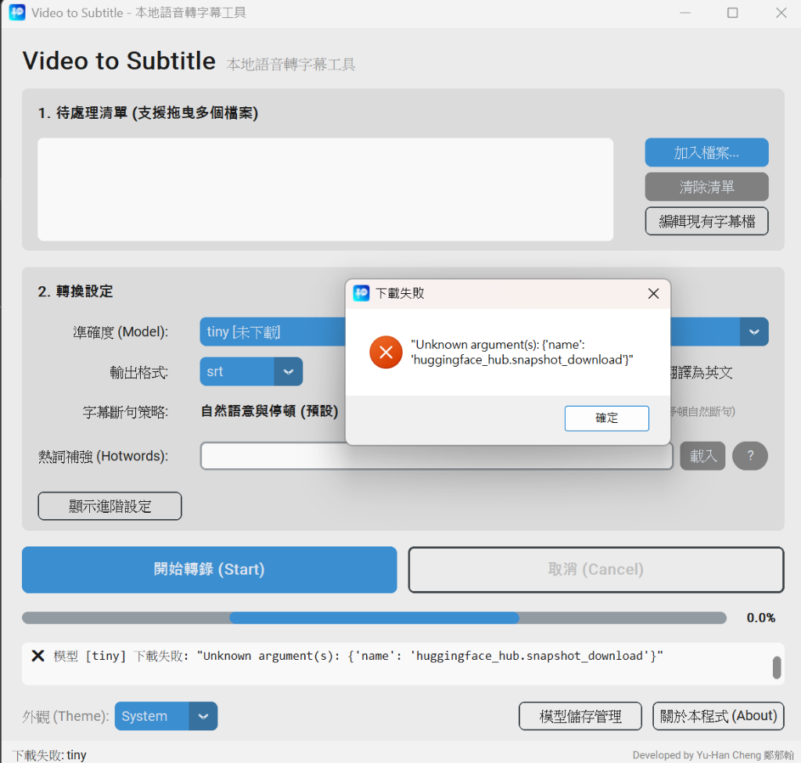

## 相關聲明
本工具僅供學習與個人使用。使用者需自行承擔使用本軟體所產生的風險。不負任何擔保。

**開發者**: 崑山科技大學 鄭郁翰 (Yu-Han Cheng) | kaoshou@gmail.com 

# Video to Subtitle (本地語音轉字幕工具)
本工具是考量了教育部將於 115 學年度起推動之政策要求，針對遠距數位課程須提供完整字幕內容，或建置合理之輔助資源配套措施，以落實保障學生平等受教權而生的解決方案。工具開發初期主要源自個人實際使用需求，考量許多教師在製作數位教材時亦面臨相同挑戰，所以將本工具整理並分享給大家使用。

基於 faster-whisper (OpenAI Whisper 的高效能實作) 模型的本地端桌面應用程式，幫它套上一層圖形介面，簡化 Whisper 的操作流程，使用者僅需進行簡單設定，即可完成影片轉換為字幕檔案（SRT、VTT）的作業，讓大家都可以簡易使用。由於程式於本機端執行，無須將影音檔案上傳至雲端，可充分利用使用者電腦算力生成影片字幕，兼具安全、免費與隱私保障，是一項可以安心的語音轉字幕解決方案。

其實目前網路上已有許多基於 Whisper 的字幕產生工具，部分採雲端服務模式，需上傳影片檔案，存在隱私疑慮，或需購買點數並受使用次數限制；另有部分本地端工具，則功能眾多或在操作流程上較為繁瑣，難以一次完成所需作業。本程式係基於實際教學與教材製作情境所開發，使用功能單純，期能以最少步驟完成字幕轉換，提升教師在製作數位教材時的效率與便利性。(字幕使用前請務必核對與校正)



## ✨ 主要功能
其實主要功能就是利用 Whisper 產生字幕檔案...
* **熱詞補強 (Hotwords)**：[NEW] 針對專有名詞、程式碼方法名稱、術語或人名提供引導辨識，大幅提升教學影片術語的精準度。
* **每行字數原則 (Max Chars)**：[NEW] 自定義單行字幕的最大字數（建議 15-25 字），系統將根據語意與標點自動分配，避免字幕過長影響閱讀。
* **本地執行**：除下載模型外，完全離線執行，基於 faster-whisper (Windows) 或 mlx-whisper (Mac)，您的影片與音訊不會離開您的電腦。
* **多模型支援**：整合 tiny 至 large-v3 模型，使用者只要選擇後，程式自動完成下載。
* **支援多檔案批次處理**：可一次加入多個檔案進行排程轉換。
* **簡化操作**：簡化 faster-whisper 的操作過程，使用者只要選擇上轉換的影片，選擇使用模型，即可一鍵完成字幕檔案產出。
* **多格式輸出**：支援輸出 SRT, VTT, TXT, TSV, JSON 等常見格式。
* **支援拖曳檔案 (Drag & Drop)**：直接將檔案拖入視窗即可加入清單，並過濾不支援的格式。

## 使用流程
  1. **選擇要轉換的檔案**：點擊「加入檔案」按鈕或**直接將檔案拖曳至程式視窗**。
      - **支援格式**：支援 MP4, MP3, MKV, WAV, MOV, AVI, M4A, FLAC, OGG, WEBM 等常見影音格式。
  2. **設定準確度 (Model)**：依據需求選擇模型大小
      - **Tiny / Base**：速度最快，但準確度較低。
      - **Small / Medium**：速度與準確度的平衡點 (一般用途推薦)。
      - **Large**：準確度最高，但轉換速度慢，需要較大記憶體。
  3. **選擇運算單元與格式**：
      - **運算單元**：Windows 可選 cpu / cuda；macOS 上可選 cpu / mps (Apple Silicon GPU，將自動啟用 MLX 框架加速)。
          - 若要在 Windows 使用 CUDA 加速，需安裝對應版本的 [cuDNN](https://developer.nvidia.com/cudnn) 。詳情請參閱 [CTranslate2 文件](https://opennmt.net/CTranslate2/installation.html)。
          - 若要在 Mac 使用 MPS 加速，請先執行 `pip install mlx-whisper` 安裝套件。
      - **輸出格式**：可選擇 SRT, VTT, TXT, TSV 或 JSON。
      - **進階功能**：可視需求勾選「強制繁體中文」(避免出現簡體中文)或「翻譯成英文」。
  5. **開始生成**：點選「開始」按鈕，程式將自動處理清單中的所有檔案。底部進度條會顯示當前檔案的處理進度。
  6. **轉換完畢**：轉換完畢後，可開啟輸出檔案確認 (預設儲存於原始影片同目錄)，根據模型不同精準度也有不同，所以請務必後續自行確認字幕的正確性，必要時請進行人工修訂。
  7. 後續可根據遠距教學平台之功能掛上字幕檔，或者將字幕檔與影片進行結合。

## 模型下載位置
這個程式使用的是 faster-whisper 函式庫，預設會將模型下載到 Hugging Face 的快取目錄中。
根據作業系統，模型存放的位置如下：
  * Windows
    >通常位於： ``` C:\Users\使用者名稱\.cache\huggingface\hub ```
    >
    >在此資料夾內，您會看到類似 models--Systran--faster-whisper-small 的資料夾，裡面就是模型檔案
    >
    >該資料夾是一個隱藏資料夾，您可能需要在檔案總管中開啟「顯示隱藏的項目」才看得到
    
  * macOS
    >通常位於： ```/Users/使用者名稱/.cache/huggingface/hub```
    >
    >.cache 也是隱藏資料夾。您可以在 Finder 中按下 Cmd + Shift + . (句號) 來顯示隱藏檔案，或者在終端機中使用 open ~/.cache/huggingface/hub 直接開啟

**提示**：若上述路徑無權限寫入 (例如在實驗室或公用電腦)，程式會詢問是否改將模型下載到程式所在資料夾下的 `models` 目錄，請放心使用。

## 📥 下載與啟動 (一般 Windows 使用者)
如果您不需要修改程式碼，請直接下載執行檔。
1. 下載程式：[前往 Releases 頁面](https://github.com/kaoshou/Video-to-Subtitle/releases) 下載最新的 VideoToSubtitle.exe。
2. 執行：雙擊 EXE 檔案即可開始使用。初次開啟需要稍待片刻。

## 🛠️ 開發與建置 (開發者)
若您希望從原始碼執行或自行打包，請參考以下步驟。

1. **環境需求**
    - Python 3.9

2. **安裝相依套件**
   也可建立虛擬環境 (Virtual Environment):
    ```bash
    python -m venv venv
    # Windows:
    .venv\Scripts\activate
    # macOS/Linux:
    source venv/bin/activate
    ```
    安裝所需套件 (Windows / 一般環境):
    ```bash
    pip install customtkinter tkinterdnd2 faster-whisper opencc pyinstaller
    ```
    (若為 Mac 開發者並需啟用 MPS 硬體加速，請額外安裝 `mlx-whisper`):
    ```bash
    pip install mlx-whisper
    ```

3. **執行程式**
   ```bash
   python SubtitleTranscriber.py
   ```

4. **使用 PyInstaller 打包為單一執行檔**
    ```bash
    pyinstaller --noconsole --onefile --name "VideoToSubtitle" --collect-all customtkinter --collect-all tkinterdnd2 --collect-all faster_whisper --collect-all opencc SubtitleTranscriber.py
    ```
    打包完成後，執行檔將位於 `dist/VideoToSubtitle.exe`。

## 📚 使用的第三方專案與授權
本工具使用了以下開源專案：
| 專案 | 授權 | 用途 |
|------|------|------|
| [faster-whisper](https://github.com/SYSTRAN/faster-whisper) | MIT | 核心語音辨識引擎 (基於 CTranslate2) |
| [CTranslate2](https://github.com/OpenNMT/CTranslate2) | MIT | 高效能 Transformer 推論引擎 (Backend) |
| [mlx-whisper](https://github.com/ml-explore/mlx-examples/tree/main/whisper) | MIT | Apple Silicon GPU (MPS) 專用高速語音辨識框架 |
| [CustomTkinter](https://github.com/TomSchimansky/CustomTkinter) | MIT | 現代化 GUI 介面框架 |
| [tkinterdnd2](https://github.com/pmgagne/tkinterdnd2) | MIT | GUI 檔案拖放支援 |
| [OpenCC](https://github.com/BYVoid/OpenCC) | Apache-2.0 | 精準的繁簡中文轉換庫 |
