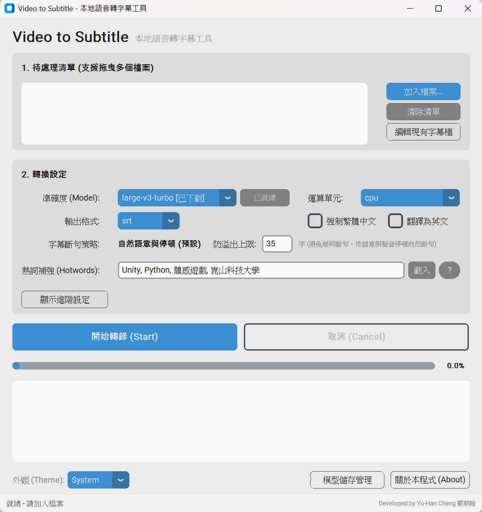
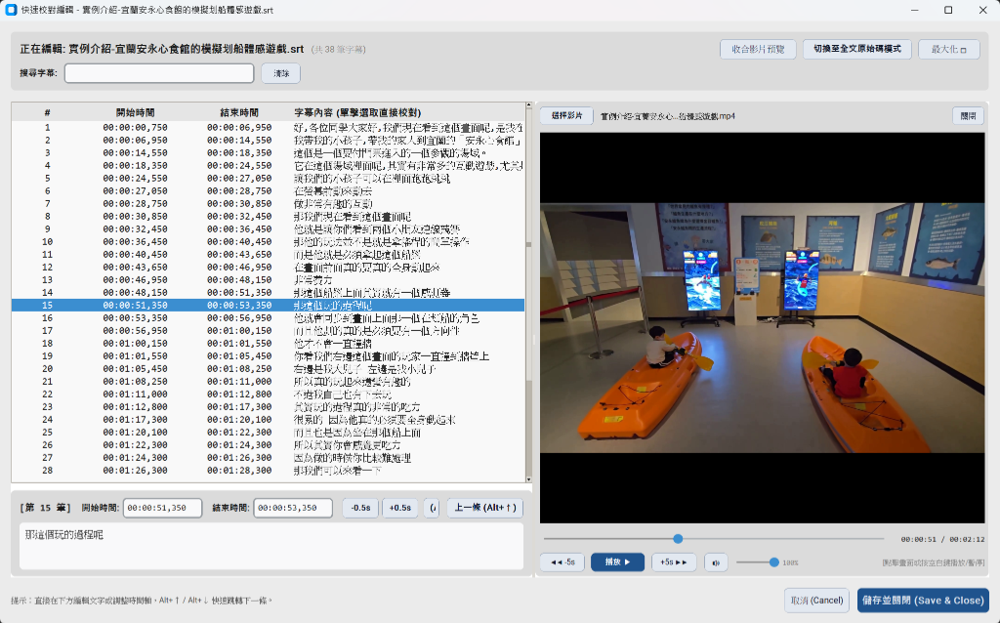
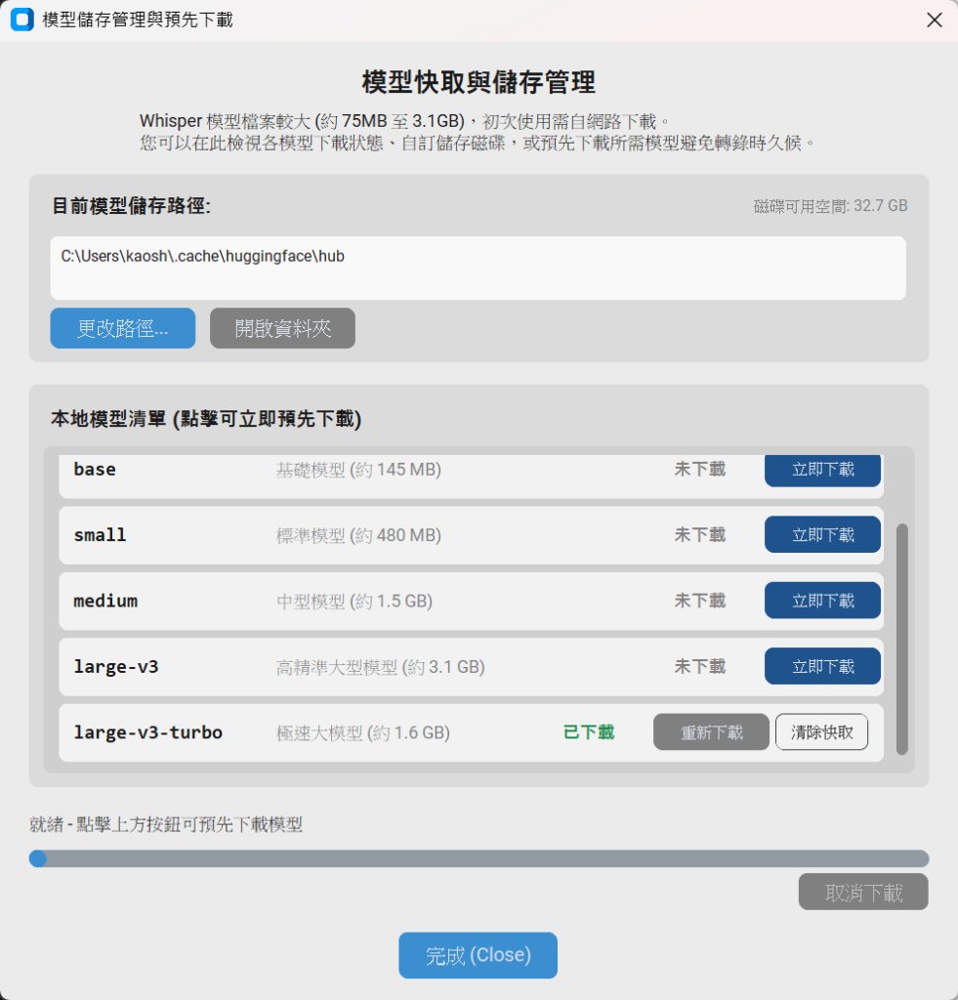

## 相關聲明
本工具僅供學習與個人使用。使用者需自行承擔使用本軟體所產生的風險。不負任何擔保。

**開發者**: 崑山科技大學 鄭郁翰 (Yu-Han Cheng) | kaoshou@gmail.com 

# Video to Subtitle (本地語音轉字幕工具)
本工具是考量了教育部將於 115 學年度起推動之政策要求，針對遠距數位課程須提供完整字幕內容，或建置合理之輔助資源配套措施，以落實保障學生平等受教權而生的解決方案。工具開發初期主要源自個人實際使用需求，考量許多教師在製作數位教材時亦面臨相同挑戰，所以將本工具整理並分享給大家使用。

基於 faster-whisper (OpenAI Whisper 的高效能實作) 模型的本地端桌面應用程式，幫它套上一層圖形介面，簡化 Whisper 的操作流程，使用者僅需進行簡單設定，即可完成影片轉換為字幕檔案（SRT、VTT）的作業，讓大家都可以簡易使用。由於程式於本機端執行，無須將影音檔案上傳至雲端，可充分利用使用者電腦算力生成影片字幕，兼具安全、免費與隱私保障，是一項可以安心的語音轉字幕解決方案。

其實目前網路上已有許多基於 Whisper 的字幕產生工具，部分採雲端服務模式，需上傳影片檔案，存在隱私疑慮，或需購買點數並受使用次數限制；另有部分本地端工具，則功能眾多或在操作流程上較為繁瑣，難以一次完成所需作業。本程式係基於實際教學與教材製作情境所開發，使用功能單純，期能以最少步驟完成字幕轉換，提升教師在製作數位教材時的效率與便利性。(字幕使用前請務必核對與校正)



## 🚀 v2.7.6 更新說明
本版本緊急修復 macOS 平台上 Apple MLX 框架加速模式無法運作的嚴重問題，並強化 CI/CD 自動化建置檢驗防護：
* **修復 macOS MLX 框架與 C 擴充動態庫損毀問題 (Critical Fix)**：
  * **根因排查**：先前版本為了精簡 DMG 體積在打包配置中啟用了二進位剝除（`strip=True`），導致系統 `strip` 工具意外抹除 `mlx`、`mlx_metal`、`tiktoken` 等 C/Metal 擴充模組之動態符號表（Dynamic Symbols），使 macOS 在動態載入時發生 `dlopen` 符號丟失崩潰，進而被捕捉誤判為「未安裝 mlx-whisper」。
  * **全面修復**：macOS 打包配置正式停用危險的 `strip=True`（維持依賴 Apple 原生 `hdiutil convert -format ULMO` 系統級壓縮即可兼顧極致輕量）；並在 PyInstaller spec 中完整補齊 `mlx_metal`、`tiktoken`、`scipy`、`torch` 等全套 MLX 關鍵相依模組。
* **CI/CD 打包流水線新增原生 Smoke Test 自動化防護**：
  * 在 GitHub Actions 的 macOS 打包流水線中加入原生 App Bundle 模組導入煙霧測試（`--test-import-mlx`），在封裝成 DMG 之前自動驗證 `mlx` 與 `mlx_whisper` 模組的完整性，杜絕任何受損組件外流。
* **增強轉錄核心 MLX 錯誤日誌回報**：
  * 重構 `transcriber.py` 中的 MLX 導入例外處理，完整輸出 Traceback 與底層真實錯誤原因至日誌區，不再因籠統攔截而隱蔽真實問題。

## 🚀 v2.7.5 更新說明
本版本帶來重磅的 **EverCam 數位課程字幕無縫整合** 與轉錄完成對話框的深度 UI/UX 重構，全面提升教師教材製作與播放體驗：
* **EverCam 數位課程現代化轉換（深度整合 [evercam-subtitle-player](https://github.com/kaoshou/evercam-subtitle-player)）**：
  * **專案全自動智慧辨識**：支援直接將 EverCam 課程資料夾拖入視窗，或透過「加入檔案...」選取 EverCam 目錄內的影音或 `config.js`，系統自動向上溯源檢測專案特徵，狀態列即時提示 `(💡 包含 X 個 EverCam 課程)`。
  * **純 Python 原生編譯 `subtitles-data.js`**：零外部相依性，高精確度解析時間軸並自動轉檔，無縫支援 `zh-TW` 繁中與英文字幕。
  * **無損首頁備份與自動部署**：自動將原始 `index.html` 備份為 `index.evercam-original.html`，並一鍵自動部署現代化 HTML5 播放器（支援字幕開關、雙語切換、關鍵字搜尋、章節導航與行動裝置友善介面）。
  * **一鍵轉換與瀏覽器即時驗收**：轉錄完成後，提供單檔「EverCam網頁轉換」與「🚀 立即轉換為 EverCam 網頁播放器 / 一鍵轉換全部的 EverCam 網頁」按鈕，點擊後 0.1 秒完成轉換並自動於系統預設瀏覽器中開啟預覽。
* **轉錄完成對話框 UI/UX 深度精進與版面修復**：
  * **排版順序底層鎖定（Bottom Priority）**：將底部操作按鈕（「關閉」、「一鍵轉換全部」）優先固定在視窗最底層，徹底根絕以往在單一檔案或小螢幕下按鈕被擠出視窗可視範圍的問題。
  * **少檔案消滅粗糙捲軸**：當檔案數量 `<= 3` 個時，徹底移除 `CTkScrollableFrame`，改用純淨 Frame，消滅右側突兀的深灰色長條捲軸。
  * **按鈕群組化 (Button Group) 與視覺收斂**：次要按鈕（開啟字幕、開啟目錄）改採精緻微灰幽靈色調；核心按鈕（字幕校對）維持品牌深藍；專屬功能（EverCam網頁轉換）以翡翠綠標註，整體寬度縮減、統一圓角，杜絕色塊雜亂衝突。
  * **專案膠囊徽章與卡片化質感**：每列檔案微框線白底卡片化，若為 EverCam 專案自動標記 `[EverCam 課程]` 綠色精巧徽章。
* **開源宣告規格修訂**：
  * 對齊開源專案規格，在「關於本程式」與 README 中正式收錄 `evercam-subtitle-player` 專案連結並移除未標註之特定授權條款。

## 🚀 v2.7.4 更新說明
本版本帶來全新自訂前導提示詞功能、進階設定面板超緊湊排版重構，並針對視窗開啟與渲染體驗進行全面技術優化：
* **自訂前導提示詞 (Initial Prompt) 與智慧繁中融合**：
  * 主操作介面新增「前導提示」輸入框，支援輸入講題背景、特定行業語境或文風風格（如技術演講、訪談風格等），引導 Whisper 產出語境更契合的字幕。
  * 提供專屬 `?` 說明彈窗，詳盡解說前導提示詞運作原理及其與「熱詞補強」的協同搭配。
  * 支援智慧融合機制：同時勾選「強制繁體中文」時，系統自動將台灣繁體中文前導句與您的自訂提示詞無縫融合，兼顧繁中標準與主題提示。
* **進階設定面板「超緊湊 2 行佈局」重構（高度縮減逾 60%）**：
  * 全面重構進階設定排版，由原本 4 行縱向堆疊改為極致輕巧的 2 行水平流暢並排（Row 0 橫排 4 個複選核取方塊；Row 1 一行整合 CPU 執行緒、標點處理、斷句策略與防溢上限）。
  * 移除原先 `CTkScrollableFrame` 右側多餘的長條捲軸槽，換回俐落純淨的卡片式 `CTkFrame`，面板展開高度縮減至僅 69px。
  * 徹底消除對下方開始按鈕與進度條的推擠感，在筆電高縮放或矮螢幕下 100% 完整容納且保有餘裕；拉長視窗時，日誌訊息區平滑自適應向下延展。
* **子視窗「背景透明預渲染技術 (Transparent Pre-render)」流暢呈現**：
  * 徹底解決開啟「關於本程式」、「模型儲存管理」、「快速校對編輯器」與「轉錄完成對話框」時元件「逐一產生、逐格跳動」的視覺問題。
  * 視窗在系統層級全透明隱匿狀態下，先行於背景記憶體強制完成所有 Canvas、圓角矩形與文字渲染，完成後瞬間一體成型浮現，提供媲美原生軟體般的自然絲滑體驗。
* **主視窗標題列修復**：
  * 修復主視窗標題偶發退回預設 `"CTk"` 的問題，嚴格綁定為「`Video to Subtitle - 本地語音轉字幕工具`」。

## 🚀 v2.7.3 更新說明
本版本在完整保留 v2.7.2 原生秒開效能的前提下，對 macOS 安裝包體積進行極限壓縮與二進位精簡優化：
* **macOS DMG 安裝包極限壓縮（下載體積暴降 60%）**：
  * 打包流水線原生整合 Apple `hdiutil convert -format ULMO / UDZO` 系統級壓縮工具，自動剔除磁碟映像檔中未分配之空白磁區，並對二進位內容進行最高等級壓縮。
  * **效果顯著**：macOS DMG 下載體積由 902 MB 縮減至 **300 多 MB** 級別，顯著節省使用者下載時間與頻寬。
* **二進位符號精簡 (Binary Strip)**：
  * 在 macOS 打包設定中全面啟用 `strip=True`，自動剔除動態庫（`.dylib`）與 C++ 擴充模組中冗餘之除錯符號（Debug Symbols），實體磁碟佔用瘦身 10%~20%。
* **極速秒開效能 100% 完整保留**：
  * 使用者掛載 DMG 並將 App 拖曳至「應用程式」後，仍維持原生展開結構，**完全享有 1~2 秒極速秒開體驗**，無須每次啟動重複解壓縮。

## 🚀 v2.7.2 更新說明
本版本針對軟體啟動效能進行全面架構級優化，大幅消除使用者點擊後的等待感，特別徹底解決 macOS 開啟時空等數十秒的痛點：
* **macOS 原生 Onedir Bundle 架構（徹底解決 macOS 開啟空等）**：
  * 打包架構升級為標準 macOS 原生目錄模式（封裝於 DMG 安裝檔內的 `.app`）。
  * 動態連結庫與依賴資源直接常駐於 App Bundle，**徹底免除每次開啟時重複解壓縮 500MB+ 檔案與 macOS Gatekeeper / XProtect 逐檔安全掃描的 20~30 秒漫長等待**，實現 1~2 秒極速開啟。
  * 外觀與操作體驗完全不變，macOS 使用者依然是將單一 App 圖示拖入「應用程式」資料夾使用。
* **AI 轉錄核心延遲載入 (Lazy Import)**：
  * 重構模組載入機制，將 `faster-whisper` 與 `ctranslate2` 的加載延後至點擊「開始轉錄」時按需載入。
  * 模組導入耗時從原本的 **5.5 秒劇降至 0.6 秒**（提升近 10 倍）。
* **多媒體播放模組延遲載入 (Lazy Import)**：
  * `PyAV`（FFmpeg C 庫）與 `sounddevice` 改為在開啟「字幕編輯器」時才按需載入，啟動時不再佔用 CPU 掃描音訊裝置或載入龐大多媒體庫。
  * 軟體啟動後，**主操作視窗在 0.5 秒內瞬間彈出**。
* **Windows 單一檔案便攜性維持**：
  * Windows 端持續維持單一檔案 `VideoToSubtitle.exe`，兼具免安裝隨身攜帶與快速秒開的優點。

## 🚀 v2.7.1 更新說明
本版本針對校對效率、操作流暢度與 macOS 跨平台環境相容性進行全面升級：
* **影片即時字幕疊加預覽 (CC / Subtitle Overlay)**：右側影片播放器畫面底部即時繪製高對比度字幕（深黑底塊 + 清晰白字，多行自動居中），具備專屬 CC 開關，左側文字編輯時即時同步更新。
* **字幕一鍵分割 (Ctrl+K) 與合併 (Ctrl+J)**：
  * **拆分 (Ctrl+K)**：在文字游標處一鍵拆為兩條，時間軸自動依前後字數比例精確切分，自動聚焦下一條。
  * **合併 (Ctrl+J)**：將當前條目與下一條字幕文字與時間軸一鍵無縫接合，刪除多餘序號並重新編號。
* **播放器多倍速播放切換**：新增播放速度切換按鈕，支援 `1.0x` ➔ `1.25x` ➔ `1.5x` ➔ `2.0x` ➔ `0.75x` 循環切換，視訊時鐘與音訊取樣率自適應同步變速。
* **字幕點選 0 毫秒極速響應（消除頓挫感）**：清理 Treeview 冗餘事件監聽，杜絕重複重繪，並對影片跳轉（Seek）加入 35ms 輕量防抖延遲，點選表格與文字載入絲滑零延遲。
* **macOS MLX 模式 FFmpeg 自動補齊與友善引導**：自動將 Homebrew 路徑（`/opt/homebrew/bin`、`/usr/local/bin` 等）注入系統 PATH，徹底解決 macOS GUI 應用找不到 ffmpeg (`[Error 2] No such file or directory`) 的問題，並於缺少時跳出直觀安裝指引。
* **macOS SSL 根憑證驗證容錯降級**：全域配置 CA 憑證路徑並實作 `safe_urlopen` 容錯機制，徹底修復點選檢查更新時出現 `[SSL: CERTIFICATE_VERIFY_FAILED]` 憑證缺失錯誤。

## 🚀 v2.7.0 更新說明
本版本帶來重大的影音同步校對體驗升級與多項細節優化：
* **全新影音同步播放器**：字幕編輯器原生整合 PyAV 與 sounddevice，支援選取字幕跳轉對應影片畫面、播放時字幕自動滾動定位，影音幀毫秒級 A/V 同步。
* **原生音訊串流與音量控制**：採用 Planar 浮點重採樣（`fltp`），還原標準 1.0x 語速與自然立體聲音質；支援音量滑桿微調（0%~100%）、動態圖示（🔊/🔉/🔇）與一鍵靜音/記憶還原。
* **左右可調分割面板 (PanedWindow)**：字幕列表與影片播放器之間提供原生分割條，支援滑鼠自由拖曳調整比例，影片畫布自動等比例平滑縮放。
* **視窗縮放與最大化完整支援**：移除視窗屬性限制，恢復系統原生最大化按鈕與雙擊標題列放大，放寬 minsize 並提供快捷鍵 F11 與工具列切換按鈕。
* **版本更新說明智慧 Fallback**：優化 GitHub Release 檢查邏輯，自動抓取 Commit 說明，徹底解決改版說明顯示為「無」的問題。

## 📸 軟體介面一覽

### 1. 軟體主操作介面
簡潔直觀的操作中心，整合多檔案拖曳清單、模型即時狀態標示、運算單元切換、繁簡台灣慣用語轉換與即時轉錄進度。


### 2. 全新高效字幕校對編輯器與影音同步播放器
專業級字幕校對工作區，提供千筆字幕秒開的結構化表格與毫秒級對齊的影音播放器：
* **雙向即時聯動**：單擊任一條字幕畫面立刻精準跳轉；影片播放或快轉時字幕清單自動捲動對齊並高亮。
* **左右可調分割面板**：滑鼠拖曳中間分割線可依需求自由拉大影片區域或展開字幕列表，影片畫面自動等比例平滑縮放。
* **原生音訊串流與音量控制**：清晰立體聲音質，具備 0%~100% 音量滑桿調節、動態圖示反饋與一鍵靜音/記憶還原。
* **視窗縮放與最大化**：支援自由拖拉視窗邊框調整大小、一鍵視窗最大化（Maximize）、快捷鍵 `F11` 與雙擊標題列放大。


### 3. 模型快取與儲存管理介面
全方位掌控本地 Whisper 模型資產，離線使用更安心：
* **自訂儲存路徑**：可自由變更模型存放磁區（如移至 D 槽），並即時顯示該磁區剩餘可用空間。
* **本地狀態清晰標示**：一目了然各模型的下載狀態（`已下載` / `未下載`）、檔案預估大小與功能說明。
* **一鍵預先下載與快取清除**：支援手動預先下載指定模型（附帶下載進度條與狀態即時更新），並可隨時一鍵清除特定模型快取釋放空間。


## ✨ 主要功能
* **支援最新 `large-v3-turbo` 與多模型切換**：整合 `tiny`、`base`、`small`、`medium`、`large-v3` 及 `large-v3-turbo`，下拉選單即時標示本地下載狀態。
* **自訂前導提示詞 (Initial Prompt)**：支援自訂講題背景、文風語境或特定主題用語，並與「強制繁體中文」智慧融合，有效提升模型對整體語意與風格的精確理解。
* **熱詞補強 (Hotwords)**：針對專有名詞、程式碼方法名稱、術語或人名提供引導辨識，大幅提升教學影片術語的精準度。
* **自然語意與停頓斷句策略 (Segmentation Strategy)**：改採語音停頓與標點符號自然斷句，尊重語音段落與單字級毫秒時間軸，避免語意碎裂。
* **本地執行與隱私安全**：除初次下載模型外，完全離線執行，基於 faster-whisper (Windows/Linux) 或 mlx-whisper (Mac)，影音資料絕不上傳雲端。
* **支援多檔案批次處理**：可一次加入多個檔案進行排程轉換，轉錄完成後提供獨立的多任務檔案管理彈窗。
* **軟體內建字幕快速校對面板**：提供「編輯現有字幕檔」功能，支援 `.srt`、`.vtt` 時間軸列表編輯與 `.txt` 大幅面文字潤飾，無須記事本即可一鍵無損儲存。
* **多格式輸出**：支援輸出 SRT, VTT, TXT, TSV, JSON 等常見格式。
* **支援拖曳檔案 (Drag & Drop)**：直接將多個檔案拖入視窗即可加入清單，並自動過濾非影音格式。
* **EverCam 數位教材一鍵轉換**：深度整合 [evercam-subtitle-player](https://github.com/kaoshou/evercam-subtitle-player)，自動偵測 EverCam 錄影專案，轉錄字幕後可一鍵將舊式 EverCam 課程網頁升級為支援字幕、搜尋與現代介面的 HTML5 播放頁面。

## 使用流程
  1. **選擇要轉換的檔案**：點擊「加入檔案...」按鈕或**直接將檔案或資料夾拖曳至程式視窗**。
      - **一般影音格式**：支援 MP4, MP3, MKV, WAV, MOV, AVI, M4A, FLAC, OGG, WEBM 等常見格式。
      - **EverCam 數位課程專案**：可直接將整個 EverCam 課程資料夾拖入程式視窗，或點選「加入檔案...」選取課程目錄下的影音檔案（或 `config.js`），系統自動溯源偵測並提示標記為 EverCam 課程專案。
  2. **設定準確度 (Model)**：依據需求選擇模型大小（選單會標示 `[已下載]` 或 `[未下載]`）
      - **Tiny / Base**：速度最快，但準確度較低。
      - **Small / Medium**：速度與準確度的平衡點 (一般用途推薦)。
      - **Large-v3-Turbo**：⭐⭐⭐ 強烈推薦！速度接近 Medium，準確率逼近 Large-v3，性價比最高。
      - **Large-v3**：準確度最高，但運算時間較長，需要較大顯存/記憶體。
  3. **選擇運算單元與格式**：
      - **運算單元**：Windows 可選 cpu / cuda；macOS 上可選 cpu / mlx (Apple Silicon GPU，將自動啟用 MLX 框架加速)。
          - 若要在 Windows 使用 CUDA 加速，需安裝對應版本的 [cuDNN](https://developer.nvidia.com/cudnn) 。詳情請參閱 [CTranslate2 文件](https://opennmt.net/CTranslate2/installation.html)。
          - 若要在 Mac 使用 MLX 加速，請確保已安裝 FFmpeg（執行 `brew install ffmpeg`）與 `mlx-whisper` 套件（執行 `pip install mlx-whisper`）。
      - **輸出格式**：可選擇 SRT, VTT, TXT, TSV 或 JSON。
      - **進階功能**：可視需求勾選「強制繁體中文」(自動轉台灣繁體)或「翻譯成英文」。
  4. **開始生成**：點選「開始轉錄」按鈕，程式將自動處理清單中的所有檔案。底部進度條會顯示當前檔案的處理進度。
  5. **轉換完畢、校對與 EverCam 網頁轉換**：
      - 轉換完成後會彈出自適應美化檔案管理面板，可直接在軟體內一鍵「開啟字幕」、「字幕校對」或「開啟目錄」。
      - **EverCam 專案現代化升級**：若處理 EverCam 專案，單檔列提供「EverCam網頁轉換」按鈕，底部提供「🚀 立即轉換為 EverCam 網頁播放器 / 一鍵轉換全部的 EverCam 網頁」按鈕。點擊後 0.1 秒自動無損升級為現代化 HTML5 字幕播放器並於預設瀏覽器中直接開啟預覽！
  6. **整合與發布**：後續可根據遠距教學平台之功能掛上字幕檔，或者將字幕檔與影片進行結合。

## 模型下載位置
這個程式使用的是 faster-whisper 函式庫，預設會將模型下載到 Hugging Face 的快取目錄中。
根據作業系統，模型存放的位置如下：
  * Windows
    >通常位於： ``` C:\Users\使用者名稱\.cache\huggingface\hub ```
    >
    >在此資料夾內，您會看到類似 models--Systran--faster-whisper-small 的資料夾，裡面就是模型檔案
    >
    >該資料夾是一個隱藏資料夾，您可能需要在檔案總管中開啟「顯示隱藏的項目」才看得到
    
  * macOS
    >通常位於： ```/Users/使用者名稱/.cache/huggingface/hub```
    >
    >.cache 也是隱藏資料夾。您可以在 Finder 中按下 Cmd + Shift + . (句號) 來顯示隱藏檔案，或者在終端機中使用 open ~/.cache/huggingface/hub 直接開啟

**提示**：若上述路徑無權限寫入 (例如在實驗室或公用電腦)，程式會詢問是否改將模型下載到程式所在資料夾下的 `models` 目錄，請放心使用。

## 📥 下載與啟動 (一般 Windows 使用者)
如果您不需要修改程式碼，請直接下載執行檔。
1. 下載程式：[前往 Releases 頁面](https://github.com/kaoshou/Video-to-Subtitle/releases) 下載最新的 VideoToSubtitle.exe。
2. 執行：雙擊 EXE 檔案即可開始使用。初次開啟需要稍待片刻。

## 🛠️ 開發與建置 (開發者)
若您希望從原始碼執行或自行打包，請參考以下步驟。

1. **環境需求**
    - Python 3.10 ~ 3.12 (推薦使用 **Python 3.11**，各平台二進位相容性最佳)

2. **安裝相依套件**
   也可建立虛擬環境 (Virtual Environment):
    ```bash
    python -m venv venv
    # Windows:
    .venv\Scripts\activate
    # macOS/Linux:
    source venv/bin/activate
    ```
    安裝所需套件 (Windows / 一般環境):
    ```bash
    pip install customtkinter tkinterdnd2 faster-whisper opencc av pillow sounddevice pyinstaller
    ```
    (若為 Mac 開發者並需啟用 MPS 硬體加速，請額外安裝 `mlx-whisper`):
    ```bash
    pip install mlx-whisper
    ```

3. **執行程式**
   ```bash
   python SubtitleTranscriber.py
   ```

4. **使用 PyInstaller 打包為執行檔**
    專案已內建完整維護之規格檔，直接執行：
    ```bash
    pyinstaller VideoToSubtitle.spec
    ```
    打包完成後，執行檔將位於 `dist/VideoToSubtitle.exe` (Windows) 或 `dist/VideoToSubtitle.app` (macOS)。

## 📚 使用的第三方專案與授權
本工具使用了以下開源專案：
| 專案 | 授權 | 用途 |
|------|------|------|
| [faster-whisper](https://github.com/SYSTRAN/faster-whisper) | MIT | 核心語音辨識引擎 (基於 CTranslate2) |
| [CTranslate2](https://github.com/OpenNMT/CTranslate2) | MIT | 高效能 Transformer 推論引擎 (Backend) |
| [mlx-whisper](https://github.com/ml-explore/mlx-examples/tree/main/whisper) | MIT | Apple Silicon GPU (MPS) 專用高速語音辨識框架 |
| [CustomTkinter](https://github.com/TomSchimansky/CustomTkinter) | MIT | 現代化 GUI 介面框架 |
| [tkinterdnd2](https://github.com/pmgagne/tkinterdnd2) | MIT | GUI 檔案拖放支援 |
| [PyAV (av)](https://github.com/PyAV-Org/PyAV) | BSD-2-Clause | 原生影音幀解碼、音訊重採樣與時間軸精準定位 |
| [Pillow](https://github.com/python-pillow/Pillow) | HPND | 影像自適應等比例縮放與畫布渲染 |
| [sounddevice](https://github.com/spatialaudio/python-sounddevice) | MIT | 跨平台低延遲音訊串流輸出 (PortAudio) |
| [OpenCC](https://github.com/BYVoid/OpenCC) | Apache-2.0 | 精準的繁簡中文轉換庫 |
| [tomli](https://github.com/hukkin/tomli) | MIT | 支援 Python 舊版本讀取 pyproject.toml 設定檔 |
| [huggingface-hub](https://github.com/huggingface/huggingface_hub) | Apache-2.0 | 語音辨識模型下載與快取儲存通道 |
| [evercam-subtitle-player](https://github.com/kaoshou/evercam-subtitle-player) | - | 提供 EverCam 傳統數位課程現代化 HTML5 字幕播放器網頁轉換模組 |
